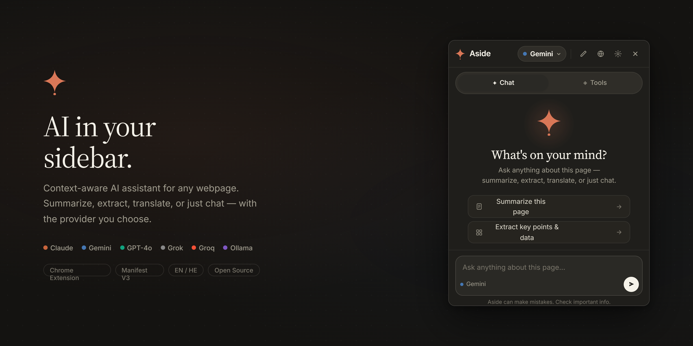
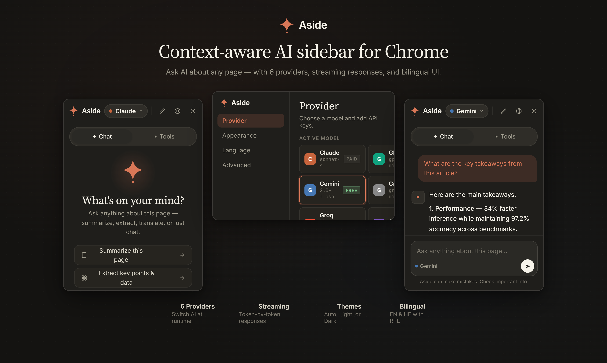
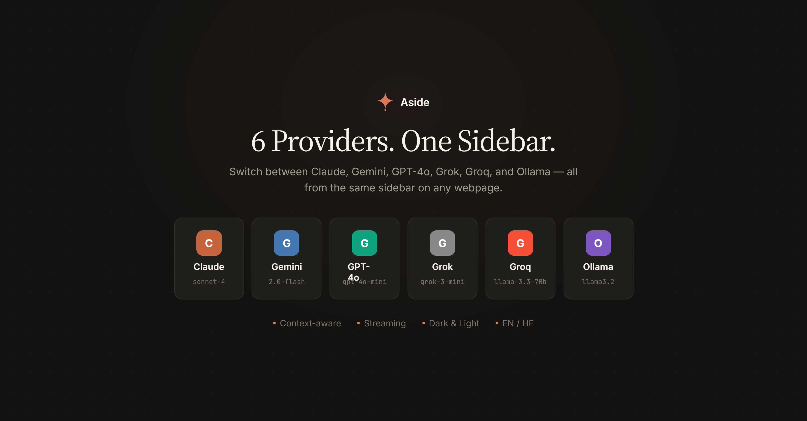

<div align="center">



# Aside

**AI in your sidebar. On any webpage.**

Ask any AI about the page you're reading — summarize, extract, translate,
or just chat. Six providers, one keystroke, zero context-switching.

<br/>

&nbsp;
&nbsp;
&nbsp;
&nbsp;


<br/><br/>

**[Why Aside](#why-aside) · [Install](#install) · [How it works](#how-it-works) · [Privacy](#privacy) · [For developers](#for-developers)**

</div>

---

## Why Aside

You're reading something — an article, a research paper, an API doc, a long
email thread — and you want an AI's take *now*, without losing your place.

Aside opens a sidebar **right where you are**. It reads the page so you
don't have to paste anything. You pick the model. You stay on the page.

<br/>

<div align="center">
  
</div>

<br/>

- **One keystroke.** `Alt + A` on any page. The sidebar slides in, already aware of what you're looking at.
- **Six AI providers.** Claude, Gemini, GPT-4o, Grok, Groq, and local Ollama — switch in a click, no separate logins.
- **Reads the page for you.** Summarize, extract key points, translate, find on page, or run a custom prompt. No copy-paste.
- **Streaming answers.** Tokens arrive as the model thinks — cancel any time.
- **Your theme. Your language.** Light, dark, or auto. English or Hebrew, with full RTL.
- **History that follows the page.** Conversations are saved per-site so you can pick up where you left off.

---

## Providers

<div align="center">
  
</div>

| Provider | What you need | Default model |
|---|---|---|
| **Claude** (Anthropic) | API key | `claude-sonnet-4-6` |
| **Gemini** (Google) | API key | `gemini-2.0-flash` |
| **OpenAI** | API key | `gpt-4o-mini` |
| **Grok** (xAI) | API key | `grok-3-mini` |
| **Groq** | API key | `llama-3.3-70b-versatile` |
| **Ollama** | Nothing — runs on your machine | `llama3.2` |

Add a key once in **Settings → Provider**. Aside validates it live against the
real API before saving. Switch providers any time from the sidebar header.

---

## Install

> Aside is open source and not yet on the Chrome Web Store. For now, install it as an unpacked extension — it takes about 30 seconds.

1. **Download** this repository ([latest ZIP](https://github.com/Royc4515/ai-sidebar/archive/refs/heads/main.zip)) and unzip it, or `git clone https://github.com/Royc4515/ai-sidebar.git`
2. Open Chrome and go to `chrome://extensions`
3. Turn on **Developer mode** (top-right toggle)
4. Click **Load unpacked** and pick the `ai-sidebar` folder
5. Pin Aside to your toolbar, then open **Settings** and paste at least one API key
6. Open any page and press **`Alt + A`** — or right-click the page and choose *Open AI Sidebar*

No build step. No npm install. No accounts. Just unzip and load.

---

## How it works

<div align="center">
  
</div>

<br/>

**Press `Alt + A`** and a slim sidebar appears on the right of the page (or
left — your choice). It already knows what's on the page, what language
the page is in, and what text you have selected.

**Tap a chip** — *Summarize*, *Key points*, *Translate*, *Explain*, *Find on page* —
or type your own prompt. Answers stream in token-by-token. Cancel any
time. Hit again on a different page and you're in a fresh conversation;
the history panel keeps the old one safe.

**Need a different provider?** The header dropdown switches between Claude,
Gemini, GPT-4o, Grok, Groq, and Ollama with one click. Each remembers its
own model selection.

---

## Privacy

- **Your API keys live on your machine.** Aside stores them in Chrome's encrypted local storage and sends them only to the provider you chose, over HTTPS. No analytics, no telemetry, no proxy server — your requests go straight from your browser to OpenAI / Anthropic / Google / xAI / Groq / your local Ollama.
- **Page content is sent only on your prompt.** When you press *Summarize* (or any action that needs the page), Aside grabs the readable body of the current tab, trims it to 12 000 characters, and includes it in **that one request**. Nothing is uploaded in the background.
- **Conversation history stays local.** Threads are saved to Chrome's `storage.local` on your device. Nothing leaves your browser until you ask the model another question.
- **Ollama mode is fully offline.** No key, no network call — your prompt and the page text go to the model running on your own computer.

---

## Keyboard shortcuts

| Shortcut | What it does |
|---|---|
| **`Alt + A`** | Toggle the sidebar on any page |
| `Esc` (inside sidebar) | Close the sidebar |
| `Ctrl/Cmd + Enter` | Send your prompt |
| Right-click → *Open AI Sidebar* | Open with selected text pre-filled |

---

## For developers

Aside is a vanilla MV3 Chrome extension — no build step, no bundler, no
framework. The full architecture, provider class hierarchy, and runtime
flow are documented in **[ARCHITECTURE.md](ARCHITECTURE.md)**.

```
background.js       MV3 service worker (Alt+A, context menu, API-key validation)
content/            page-injected script + iframe host
sidebar/            main chat UI (HTML/CSS/JS, no framework)
options/            settings page (API keys, model picker, language)
popup/              toolbar popup
providers/          BaseProvider + 6 concrete providers + factory
shared/             provider monograms, helpers
_locales/{en,he}/   chrome.i18n message catalogs
```

Contributions welcome — open an issue or PR.

---

<div align="center">
  <sub>Built with care. MIT licensed. © 2026 Roy Carmelli.</sub>
</div>
