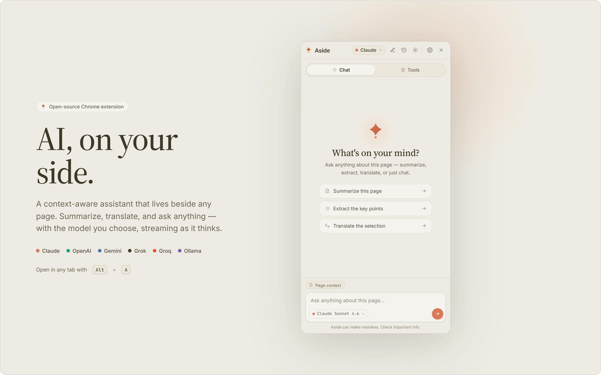
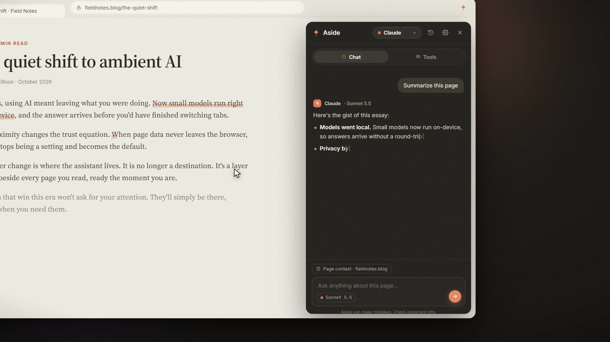
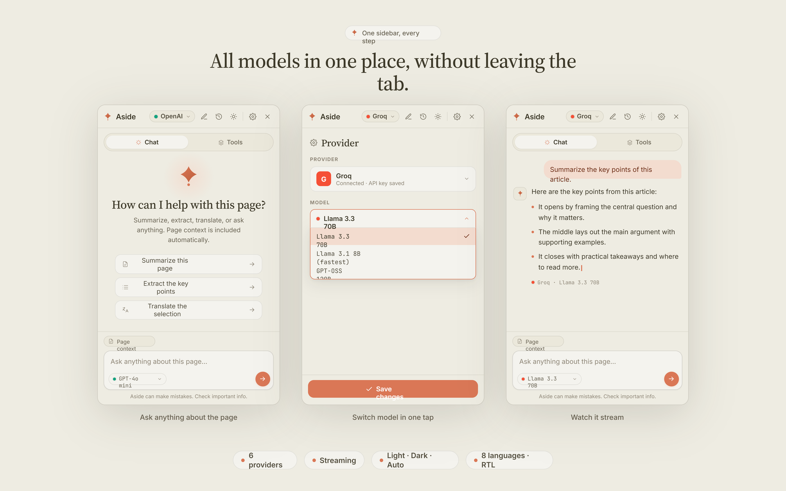
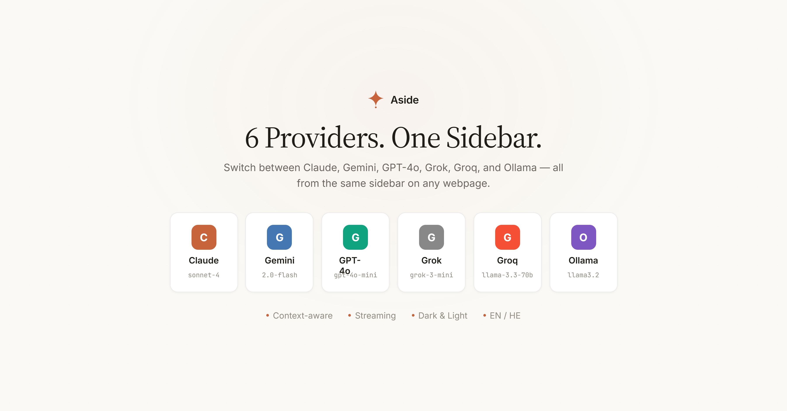
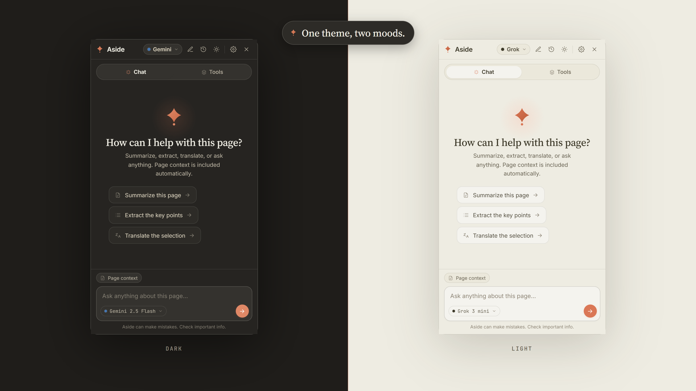

<div align="center">

<picture>
  <source media="(prefers-color-scheme: dark)" srcset="marketing/hero-dark.png">
  
</picture>

# Aside - AI sidebar for Chrome

**AI in your sidebar. On any webpage.**

Aside is a free, open-source Chrome extension that opens an AI sidebar on any
webpage, so you can summarize, translate, extract or chat about the page with
Claude, ChatGPT (OpenAI), Gemini, Grok, Groq or a local Ollama model, using
your own API key (BYOK). Keys stay in your browser, there is no server or
analytics, and the interface comes in English and Hebrew with full RTL support.

**[Website](https://royc4515.github.io/Aside/) · [אתר בעברית](https://royc4515.github.io/Aside/he/)**

<br/>

&nbsp;
&nbsp;
&nbsp;
&nbsp;
&nbsp;


<br/><br/>

**[Demo](#see-it-in-action) · [Why Aside](#why-aside) · [Install](#install) · [How it works](#how-it-works) · [Privacy](#privacy) · [FAQ](#faq) · [For developers](#for-developers)**

</div>

---

## See it in action

<div align="center">
  <a href="https://royc4515.github.io/Aside/#demo">
    
  </a>
  <br/>
  <sub><b>30 seconds, sound on:</b> <code>Alt + A</code> on an article, a streamed summary from Claude Sonnet 5.5,
  then a one-click switch to Gemini for a follow-up.
  <a href="https://royc4515.github.io/Aside/#demo">Watch on the site</a> · <a href="site/assets/video/aside-demo.mp4">MP4</a></sub>
</div>

---

## Why Aside

You're reading something - an article, a research paper, an API doc, a long
email thread - and you want an AI's take *now*, without losing your place.

Aside opens a sidebar **right where you are**. It reads the page so you
don't have to paste anything. You pick the model. You stay on the page.

<br/>

<div align="center">
  <picture>
    <source media="(prefers-color-scheme: dark)" srcset="marketing/features-dark.png">
    
  </picture>
</div>

<br/>

- **One keystroke.** `Alt + A` on any page. The sidebar slides in, already aware of what you're looking at.
- **Six AI providers.** Claude, Gemini, OpenAI, Grok, Groq, and local Ollama - switch in a click, no separate logins.
- **Reads the page for you.** Summarize, extract key points, translate, find on page, or run a custom prompt. No copy-paste.
- **Streaming answers.** Tokens arrive as the model thinks - cancel any time.
- **Your theme. Your language.** Light, dark, or auto. The interface is English or Hebrew (full RTL); ask the model to reply in any of eight languages.
- **History that follows the page.** Conversations are saved per-site so you can pick up where you left off.

---

## Providers

<div align="center">
  <picture>
    <source media="(prefers-color-scheme: dark)" srcset="marketing/providers-dark.png">
    
  </picture>
</div>

| Provider | What you need | Default model | Also selectable |
|---|---|---|---|
| **Claude** (Anthropic) | API key | `claude-sonnet-5-5` | Opus 5.5, Fable 5.1, Haiku 5.5 |
| **Gemini** (Google) | API key | `gemini-3.5-flash-lite` | 3.8 Flash, 3.1 Pro (preview) |
| **OpenAI** | API key | `gpt-6-luna` | GPT-6.1 Sol, GPT-6 Astra |
| **Grok** (xAI) | API key | `grok-4.3` | Grok 4.20 (no reasoning), Grok 4.7 |
| **Groq** | API key | `openai/gpt-oss-120b` | GPT-OSS 20B |
| **Ollama** | Nothing - runs on your machine | `qwen3.5` | Qwen 3.5 4B, Gemma 4, GPT-OSS 20B, Llama 3.2 / 3.1 |

**Ollama setup:** pull a model first (`ollama pull qwen3.5`, or `qwen3.5:4b` on
smaller laptops). Ollama also rejects browser-extension requests unless you allow
them: start it with `OLLAMA_ORIGINS=chrome-extension://*`. If you haven't picked
a model and the default isn't downloaded, Aside switches to one you already have
and saves it as your pick.

Add a key once in **Settings → Provider**, then pick a model from the **Model**
dropdown - or choose **Custom…** to type any model id the provider supports
(handy when a provider ships a new model before this list catches up). Custom
ids are remembered per provider, so they reappear under **Saved custom** in
both the Settings picker and the sidebar composer for one-click reuse - and you
can remove them just as easily. Aside validates keys live before saving. Switch
providers any time from the sidebar header; each remembers its own model.

---

## Install

> Aside is open source and not yet on the Chrome Web Store. Install it as an
> unpacked extension - about **30 seconds**, no build, no npm, no account.

### Step 1 · Install the extension

1. **Download the extension.** Grab [`aside.zip`](https://github.com/Royc4515/Aside/releases/latest/download/aside.zip) from the [latest release](https://github.com/Royc4515/Aside/releases/latest) and unzip it anywhere. It's a slim, runtime-only build (~83 KB). _(Developers: `git clone https://github.com/Royc4515/Aside.git` to get the full source instead.)_
2. **Open Chrome extensions.** Paste `chrome://extensions` into the address bar and press <kbd>Enter</kbd>.
3. **Turn on Developer mode.** Top-right toggle. Without it, Chrome won't load an unpacked extension.
4. **Load unpacked.** Click *Load unpacked* and select the unzipped `aside` folder (the one containing `manifest.json`).
5. **Pin it to the toolbar.** Click the puzzle icon in the toolbar and pin Aside so it's one click away.
6. **Set the `Alt + A` shortcut.** Chrome only auto-assigns shortcuts for Web Store extensions, so set it once by hand: open `chrome://extensions/shortcuts`, find **Aside**, click the box next to *Toggle the AI sidebar*, and press <kbd>Alt</kbd> + <kbd>A</kbd>. (You can also just open it from the toolbar icon or the right-click menu.)

### Step 2 · Get a free Groq API key (recommended)

> Groq runs OpenAI's open-weight GPT-OSS 120B at conversational speed and has a free tier - perfect for daily use. About **60 seconds**.

1. **Open the Groq console.** [console.groq.com/keys](https://console.groq.com/keys) - a clean sign-in page; Google, GitHub, or email all work.
2. **Sign in.** No credit card required. The free tier covers about a thousand requests a day.
3. **Create an API key.** Click *Create API Key*, name it something like `Aside`, and confirm.
4. **Copy the key.** Groq shows it once. Copy it now - you can always create another later.
5. **Paste it into Aside.** Open Aside → *Settings* → *Groq*, paste the key, save. The sidebar validates it live before storing.

Prefer a different provider? Same flow with Anthropic Claude, OpenAI, Google Gemini, xAI Grok, or self-hosted Ollama. See [Providers](#providers) for what each one needs.

**Maintainers - cutting a release:** Bump `version` in `manifest.json` and add a matching `## <version> - <date>` section to `CHANGELOG.md` (the workflow refuses a heading that still says "unreleased"), then run the **Release** workflow on `main` (Actions → Release → Run workflow) or push a `v<version>` tag. It builds `aside.zip` with `scripts/build-zip.sh` (runtime files only) and publishes a GitHub release with that section as the notes, so the [latest-download link](https://github.com/Royc4515/Aside/releases/latest/download/aside.zip) always serves the newest build. To build locally instead: `pwsh ./scripts/build-zip.ps1` or `bash ./scripts/build-zip.sh`.

**Maintainers - keeping models current:** The model list is refreshed on the 1st of every month following [docs/MONTHLY_UPDATE.md](docs/MONTHLY_UPDATE.md). Run `node scripts/check-models.mjs` after any model change. It fails if the catalog, provider code, and docs disagree.

---

## How it works

<div align="center">
  
</div>

<br/>

**Press `Alt + A`** and a slim sidebar appears on the right of the page (or
left - your choice). It already knows what's on the page, what language
the page is in, and what text you have selected.

**Tap a chip** - *Summarize*, *Key points*, *Translate*, *Explain*, *Find on page* -
or type your own prompt. Answers stream in token-by-token. Cancel any
time. Hit again on a different page and you're in a fresh conversation;
the history panel keeps the old one safe.

**Need a different provider?** The header dropdown switches between Claude,
Gemini, OpenAI, Grok, Groq, and Ollama with one click. Each remembers its
own model selection.

---

## Privacy

- **Your API keys live on your machine.** Aside stores them in Chrome's on-device `storage.local` - never synced to a Google account, never uploaded - and sends them only to the provider you chose, over HTTPS. No analytics, no telemetry, no proxy server - your requests go straight from your browser to OpenAI / Anthropic / Google / xAI / Groq / your local Ollama.
- **Page content is sent only on your prompt.** When you press *Summarize* (or any action that needs the page), Aside grabs the readable body of the current tab, trims it to 12 000 characters, and includes it in **that one request**. Nothing is uploaded in the background.
- **Conversation history stays local.** Threads are saved to Chrome's `storage.local` on your device. Nothing leaves your browser until you ask the model another question.
- **Ollama mode is fully offline.** No key, no network call - your prompt and the page text go to the model running on your own computer.

---

## Keyboard shortcuts

| Shortcut | What it does |
|---|---|
| **`Alt + A`** | Toggle the sidebar on any page |
| `Esc` (inside sidebar) | Close the sidebar |
| `Ctrl/Cmd + Enter` | Send your prompt |
| Right-click → *Open AI Sidebar* | Open with selected text pre-filled |

---

## FAQ

**Is Aside free?** Yes. The extension is free and MIT licensed. You pay each
AI provider for API usage directly, or use a free tier (Groq and Gemini offer
one). Ollama runs locally with no key.

**Does it work with a ChatGPT Plus or Claude Pro subscription?** No. Aside is
bring-your-own-key: it calls each provider's API with an API key from that
provider's console, which is billed separately from chat subscriptions.

**Does it support Hebrew and right-to-left pages?** Yes. The interface is
available in Hebrew with full RTL, the sidebar follows the direction of RTL
pages, and the model can reply in eight languages (English, Hebrew, Spanish,
French, German, Chinese, Arabic, Japanese), by default in the page's language.

**Can I compare two models?** Yes. Compare mode sends one prompt to two
providers and shows both answers side by side; keep the one you prefer.

**Is it on the Chrome Web Store?** Not yet. See [Install](#install) for the
30-second unpacked install. It needs Chrome 114 or later.

---

## For developers

Aside is a vanilla MV3 Chrome extension - no build step, no bundler, no
framework. The full architecture, provider class hierarchy, and runtime
flow are documented in **[docs/ARCHITECTURE.md](docs/ARCHITECTURE.md)**.

```
background.js       MV3 service worker (Alt+A, context menu, API-key validation)
content/            page-injected script + iframe host
sidebar/            main chat UI (HTML/CSS/JS, no framework)
options/            settings page (API keys, model picker, language)
popup/              toolbar popup
providers/          BaseProvider + 6 concrete providers + factory
shared/             provider monograms, helpers
_locales/{en,he}/   chrome.i18n message catalogs
```

Contributions welcome - open an issue or PR.

---

<div align="center">
  <sub>Built with care. MIT licensed. © 2026 Roy Carmelli.</sub>
</div>
