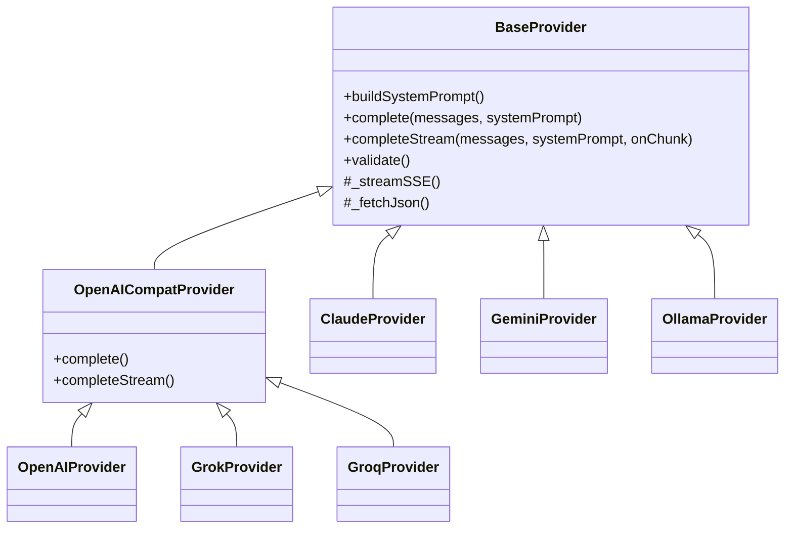
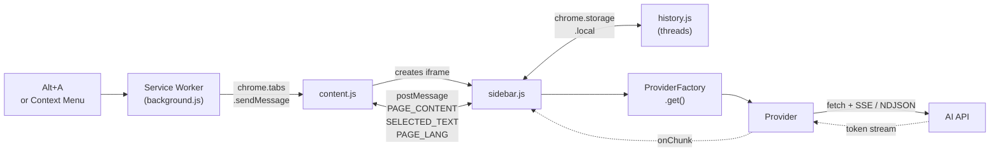

# Aside — Architecture

Technical documentation for contributors. For the user-facing description,
see [README.md](README.md).

---

## Provider System

- **Six AI providers** — Claude, Gemini, OpenAI, Grok, Groq, and Ollama; selected at runtime via `ProviderFactory`.
- **Shared OpenAI-compatible base** — `OpenAICompatProvider` implements the chat-completions wire format once; `OpenAIProvider`, `GrokProvider`, and `GroqProvider` are thin subclasses that set `url` and `model`.
- **Uniform message-array API** — every provider takes `(messages[], systemPrompt)`; the sidebar never branches on which class is running.

## Conversation & UI

- **Streaming responses** — token-by-token via SSE (`_streamSSE`) for OpenAI-style providers and NDJSON for Ollama; cancellable from the UI.
- **Multi-turn conversation history** — threads persisted to `chrome.storage.local` (5 MB), with an in-sidebar history panel, search, per-page filter, and restore.
- **Quick page actions** — one-tap chips for summarize / explain / key-points / translate / find on page, plus a curated prompt-template menu.
- **Bilingual UI (EN / HE)** — `translations.js` table + runtime `i18n.js` helper; UI flips RTL when Hebrew is active. Includes page-language auto-detection via `PAGE_LANG` message.
- **Per-provider model picker** — Settings page lets each provider keep its own selected model.

## Extension Platform

- **MV3 service worker** — `background.js` handles the `Alt+A` keyboard command, context-menu registration, and live `VALIDATE_KEY` requests with a 10-second `Promise.race` timeout.
- **Authenticated `postMessage` bridge** — because `content.js` shares the host page's origin, the sidebar iframe cannot trust messages by origin alone. `content.js` mints a random nonce, stores it in `chrome.storage.session` (unreadable by page scripts), passes the channel id through the iframe URL hash, and tags every message it posts *into* the iframe; the sidebar reads the same nonce and rejects anything without it. The reverse direction (iframe → content) is trusted by `event.source === iframe.contentWindow`, which page scripts cannot spoof. The nonce is never echoed back to the parent, so the page never observes it. AI responses are rendered through an HTML-escaping markdown pass; user/host text is escaped before it reaches `innerHTML`.
- **Local-only storage** — API keys and settings live in `chrome.storage.local` via `shared/store.js`; nothing uses `chrome.storage.sync`, so no data is synced to a Google account or any server. A one-time migration moves data left in `sync` by older versions into `local` and clears it.
- **Page content extraction** — `extractPageContent()` walks semantic selectors (`article`, `main`, `[role="main"]`, `.article-body`…), strips nav/chrome nodes, and truncates at 12 000 chars.
- **Live API-key validation** — Settings sends `VALIDATE_KEY` to the service worker, which instantiates the provider and calls `validate()` against the real API.
- **Custom Markdown renderer** — hand-rolled `renderMarkdown()` covers headings, bold/italic, code blocks, tables, and lists; output is sanitized by a DOM-based allowlist (`sanitizeHTML()`) before insertion.

---

## Class Hierarchy



## Runtime Flow



`ProviderFactory.get(name, apiKeys, selectedModels)` applies the **Strategy
pattern** — the sidebar calls `provider.completeStream(messages,
systemPrompt, onChunk)` with no knowledge of which class is running.
`OpenAIProvider`, `GrokProvider`, and `GroqProvider` reuse the entire
`OpenAICompatProvider` implementation by only declaring their endpoint URL
and default model. Switching providers requires a single
`chrome.storage.local` write.

## Project Layout

```
background.js              ← MV3 service worker
manifest.json              ← MV3 manifest (Alt+A command, context menu, options_ui)
_locales/{en,he}/          ← chrome.i18n message catalogs
content/                   ← page-injected content script + iframe host CSS
sidebar/
  sidebar.{html,css,js}    ← main chat UI
  history.js               ← thread storage layer
  i18n.js + translations.js← runtime UI translation
  action-config.js         ← page-action chip definitions
  prompt-templates.js      ← one-tap prompt presets
options/                   ← settings page (API keys, model picker, language)
popup/                     ← toolbar popup
providers/                 ← BaseProvider + 6 concrete providers + factory
shared/provider-marks.js   ← shared SVG provider monograms
```

## Provider matrix

| Provider | Default model | Additional models |
|---|---|---|
| **Claude** (Anthropic) | `claude-sonnet-4-6` | `claude-haiku-4-5-20251001` · `claude-opus-4-7` |
| **Gemini** (Google) | `gemini-2.0-flash` | `gemini-1.5-flash` · `gemini-1.5-pro` · `gemini-2.5-pro` |
| **OpenAI** | `gpt-4o-mini` | `gpt-4o` · `o4-mini` |
| **Grok** (xAI) † | `grok-3-mini` | `grok-3` |
| **Groq** † | `llama-3.3-70b-versatile` | `llama-3.1-8b-instant` · `gemma2-9b-it` |
| **Ollama** (local) | `llama3.2` | any locally pulled model |

<sup>† Grok, Groq, and OpenAI all extend `OpenAICompatProvider` — the chat-completions wire format is shared in one place.</sup>
